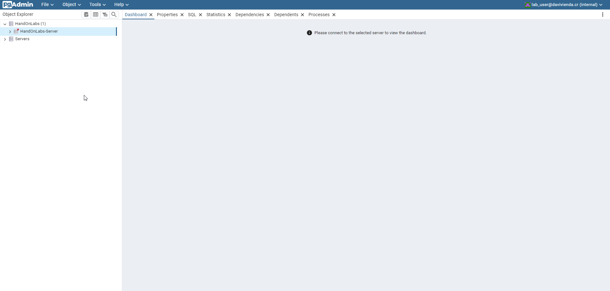

# Hands-On Labs - Infraestructura Transversal

## Gestión de Libros en una Biblioteca

Este repositorio le proporciona los artefactos necesarios para levantar en su instancia de Docker:

* PostgreSQL versión 16.3-alpine3.19
* PGAdmin4 versión 8.8

### Pasos para Levantar los Servicios

1. Abra una terminal y ejecute los siguientes comandos. Le recomendamos copiar cada línea por separado:

```powershell
cd ~\source\repos\

git clone https://crsjce010171vm.daviviendacr.com/TI_SourceCode/Training/_git/hands-onlabs-infra

cd hands-onlabs-infra
```

2. Levante los servicios ejecutando el siguiente comando:

```powershell
docker compose up -d
```

Deberá obtener una salida similar a la siguiente:

```powershell
➜ docker compose up -d
[+] Running 26/26
 ✔ db Pulled                                                                                      50.1s
   ✔ 17415534d4c3 Download complete                                                                1.3s
   ✔ 30776f87fdac Download complete                                                                1.2s
   ✔ 3c78bc305665 Download complete                                                                1.4s
   ✔ b52c09c8a361 Download complete                                                                1.0s
   ✔ e4d19e4cb2bb Download complete                                                                1.1s
   ✔ c88bb5f2ca44 Download complete                                                               41.7s
   ✔ 043cce828bad Download complete                                                                1.1s
   ✔ 09a849e359e3 Download complete                                                                1.5s
 ✔ pgadmin Pulled                                                                                141.2s
   ✔ 42c5057ce197 Download complete                                                               26.9s
   ✔ 7e5f2f99b227 Download complete                                                              127.0s
   ✔ 049e3e498edf Download complete                                                                1.2s
   ✔ 3531d48da844 Download complete                                                                1.3s
   ✔ 7ed7a99b225a Download complete                                                                1.2s
   ✔ 9f55b05b9446 Download complete                                                                1.9s
   ✔ 50fce75ceff5 Download complete                                                                1.3s
   ✔ 5f3f425defc8 Download complete                                                                2.2s
   ✔ d95e877ecae7 Download complete                                                                1.4s
   ✔ 7e919cc139ae Download complete                                                                1.4s
   ✔ c757d24af80e Download complete                                                                1.5s
   ✔ 7844fbd31665 Download complete                                                                1.8s
   ✔ 94314112c18b Download complete                                                                1.6s
   ✔ 66401e7eeaaf Download complete                                                               19.1s
   ✔ d25f557d7f31 Download complete                                                                2.4s
   ✔ cd1e01554a53 Download complete                                                               11.4s
[+] Running 3/3
 ✔ Network hands-onlabs-infra_library_net  Created                                                 0.2s
 ✔ Container library_db                    Started                                                39.0s
 ✔ Container hands-onlabs-infra-pgadmin-1  Started                                                39.0s
```

> **Importante:** Si su salida difiere, solicite ayuda al instructor.

### Verificación del Despliegue

Para comprobar que el despliegue fue exitoso, abra su navegador web e ingrese a la URL de PGAdmin (http://localhost:5051/login).


Inicie sesión utilizando las siguientes credenciales:

- User: lab_user@davivienda.cr
- Password: postgres

